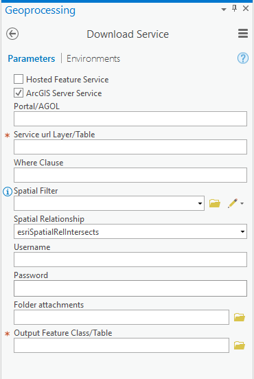

## Download service data for ArcGIS Pro

#### Description

You can download data and attachment from Map or Feature Service

Select *Hosted Feature Service* if the feature service is in arcgis.com or in a federated portal or
select *ArcGIS Server Service* is the feature service or map service is in ArcGIS Server.

If you select *Hosted Feature Service* and your service is protected you need select in the list *Portal/AGOL* the connection of ArcGIS Pro
to connect at service. However yu need insert user and password.

In *Service url Layer/Table* insert the url of service's layer. Can be a *Feature Layer* or a *Table*.
Example Service url Layer:
https://host/server/rest/services/SampleAttach/MapServer/3
http://host/OrgID/ArcGIS/rest/services/Earthquakes/EarthquakesFromLastSevenDays/FeatureServer/0 

In *Where* set a where clause for the query filter. Any legal SQL WHERE clause operating on the fields in the layer is allowed
If it is empty you download all records.

In *Spatial Filter* you can set a feature class or if you have a map opened you can digitalize a geometry on the fly.
The geometry is used to apply as the spatial filter.

The *Spatial Relationship* is applied on the input geometry while performing the query. The supported spatial relationships include intersects, contains, envelope intersects, within, and so on. The default spatial relationship is intersects (esriSpatialRelIntersects)

The *Username* and *Password* are required if the service is protected

In *Folder attachments* you can set an empty folder for download attachments of layer/table. It downloads files if the layer / table has attachments, the *hasAttachments* property of service should be true.

In *Output Feature Class/Table* select a dataset (feature class/table) for output 

<p align="center">

</p>

If you have a proxy for connection you can set the variable PROXY in the start of script
For example:

```<language>
    PROXIES = {
      "http": "http://10.10.1.10:3128",
      "https": "http://10.10.1.10:1080",
    }
```

In script there is a variable CHUNK. It's set 200 so every request sends chunk of 200 oids.
If there's an error in request you can try to set a lower value (there's a limit of length in featureset.load())
However if you set a value superior of *maxRecountCount* it's set *maxRecountCount*  

### TODO
- download domains
- download relate data
- set output fields

## Issues

Find a bug or want to request a new feature?  Please let us know by submitting an issue.

## Contributing

Anyone and everyone is welcome to contribute.

### Requirements

[ArcGIS Pro](https://pro.arcgis.com/en/pro-app/)
